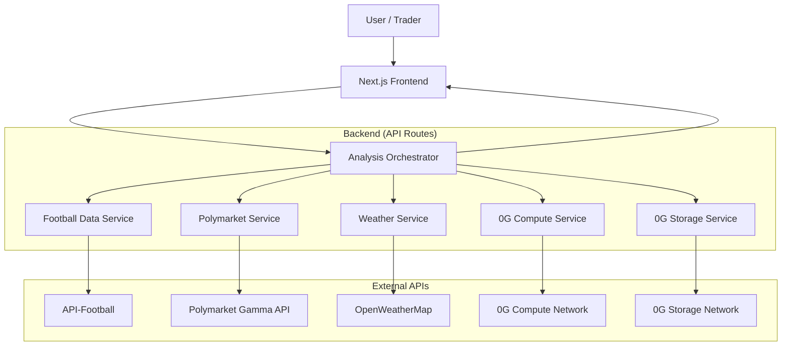
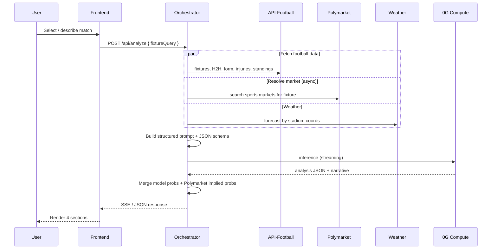

# Match Analyst — Architecture

Polymarket Football AI Analyst: a research tool that produces data-driven match probabilities and compares them to Polymarket prices when available. **Analysis only — not betting or financial advice.**

---

## 1. Overview

### 1.1 Purpose

Users ask about upcoming football matches. The system:

1. Resolves the fixture from structured or natural-language input
2. Fetches real football statistics from external APIs (never hallucinated)
3. Runs inference via **0G Compute** with a strict analyst persona and JSON schema
4. Optionally fetches **Polymarket Gamma API** prices for market context
5. Renders four UI sections: Match Input, AI Analysis, Probability Breakdown, Trading Insight

### 1.2 Design Principles

| Principle | Implementation |
|-----------|----------------|
| Data before inference | All stats injected into the LLM prompt as structured facts |
| Football leads, market follows | Polymarket is context/comparison, not the primary signal |
| Graceful degradation | Missing Polymarket market or thin liquidity → hide or warn, never error |
| Verifiable AI | 0G Compute for decentralized inference; optional 0G Storage for memory |
| Trader-friendly output | Probabilities, deltas, confidence — not narrative-only |

---

## 2. System Context



---

## 3. Data Sources

### 3.1 Primary: API-Football (api-sports.io)

| Endpoint | Use |
|----------|-----|
| `fixtures` | Upcoming matches, kickoff, venue |
| `fixtures/headtohead` | H2H history |
| `teams/statistics` | Season form, home/away splits |
| `standings` | Table position, motivation context |
| `injuries` | Unavailable players |
| `fixtures/lineups` | Confirmed XIs (pre-kickoff) |
| `fixtures/statistics` | Shots, possession, xG where available |
| `fixtures/events` | Goals, cards (historical context) |

**Tiers:** Free (100 req/day, prototype) → Pro $19/mo (launch) → Ultra $29/mo (scale).

### 3.2 Market Context: Polymarket Gamma API

- Base: `https://gamma-api.polymarket.com`
- Sports: `/sports`, event/market lookup by slug or search
- Read-only; no authentication for public market data
- Used for **comparison only**, not as input to the model's football reasoning

### 3.3 Supplementary

| Source | Use |
|--------|-----|
| OpenWeatherMap | Stadium weather (temp, rain, wind) |
| StatsBomb Open Data | Optional offline xG calibration (not live) |

### 3.4 User Memory: 0G Storage

- Favorite teams and leagues
- Saved predictions with Polymarket snapshot at analysis time
- Optional accuracy tracking (model vs actual result)

---

## 4. Analysis Pipeline



### 4.1 Orchestrator Steps

1. **Resolve fixture** — map teams + date → `fixture_id` (API-Football)
2. **Batch fetch** — parallel requests; cache per fixture (TTL: 15 min pre-match, 5 min near kickoff)
3. **Match Polymarket** — fuzzy match team names + competition → market slug; extract outcome prices
4. **Build prompt** — inject all facts; forbid model from inventing stats
5. **0G inference** — analyst system prompt + structured output schema
6. **Post-process** — compute deltas (model − market), confidence, liquidity warnings
7. **Persist** — optional save to 0G Storage

### 4.2 LLM Output Schema

```json
{
  "probabilities": {
    "home": 0.58,
    "draw": 0.25,
    "away": 0.17
  },
  "confidence": "medium",
  "narrative": "Conversational analysis paragraph(s)...",
  "key_factors": [
    { "factor": "Home form", "impact": "positive", "weight": 0.25, "detail": "4W in last 5" },
    { "factor": "Injuries", "impact": "negative", "weight": 0.15, "detail": "Key midfielder out" }
  ],
  "risks": ["Lineups not confirmed", "Derby volatility"],
  "trading_insight": "Model sees home win ~6% above market; driven by form and injury edge."
}
```

Probabilities must sum to ~1.0 (±0.02). Post-validate and normalize if needed.

### 4.3 0G Compute Integration

Pattern (aligned with existing `0g-route` broker setup):

- Initialize `@0glabs/0g-serving-broker` with wallet + RPC
- Fund ledger for inference credits
- Select football-analyst provider / model on 0G marketplace
- Stream tokens to frontend via SSE
- Optional: verify response signatures for "AI-backed" saved ideas

---

## 5. Polymarket Integration

### 5.1 Fixture → Market Matching

1. Query Gamma `/sports` or search events by team names
2. Normalize names (e.g. "Man Utd" ↔ "Manchester United")
3. Prefer **Match Winner** market; support BTTS / O-U in Phase 2
4. Store: `market_slug`, `volume`, `liquidity`, `outcome_prices[]`, `fetched_at`

### 5.2 Implied Probabilities

Convert Polymarket outcome prices to percentages. If prices don't sum to 100% (spread), normalize or show raw + note.

### 5.3 Display Rules (by UI section)

| Section | Polymarket content |
|---------|-------------------|
| **Match Input** | Badge: market found / not found; volume; market type selector |
| **AI Analysis** | At most one contextual sentence; link to Breakdown |
| **Probability Breakdown** | **Primary display** — side-by-side table + bars + Δ column |
| **Trading Insight** | Interpretation only (largest gap, market lean, caveats, external link) |

### 5.4 Edge Cases

| Case | Behavior |
|------|----------|
| No market | Hide Polymarket column; copy: "No active Polymarket market" |
| Low liquidity | Show prices + warning badge |
| Multiple markets | Dropdown in Match Input; default Match Winner |
| Stale prices | Show `fetched_at`; refresh button |

---

## 6. Frontend Architecture

### 6.1 Stack

- **Next.js 14+** (App Router)
- **TypeScript**
- **CSS Modules** or Tailwind (TBD at scaffold)
- **SSE** for streaming AI Analysis section

### 6.2 Page Layout

```
┌─────────────────────────────────────────────────────────┐
│ Header — logo, favorites, saved analyses                │
├─────────────────────────────────────────────────────────┤
│ MATCH INPUT                                             │
│ Team search · league · date · [Polymarket ✓ $38k]     │
├─────────────────────────────────────────────────────────┤
│ AI ANALYSIS (streaming)                                 │
├─────────────────────────────────────────────────────────┤
│ PROBABILITY BREAKDOWN                                   │
│ Home │ AI 58% │ Poly 52% │ +6%                         │
│ Draw │ AI 25% │ Poly 28% │ -3%                         │
│ Away │ AI 17% │ Poly 20% │ -3%                         │
├─────────────────────────────────────────────────────────┤
│ TRADING INSIGHT + [Save] [View on Polymarket ↗]         │
├─────────────────────────────────────────────────────────┤
│ Disclaimer — research only, not advice                  │
└─────────────────────────────────────────────────────────┘
```

### 6.3 Key Components

| Component | Responsibility |
|-----------|----------------|
| `MatchInput` | Fixture search, favorites, market badge |
| `AnalysisStream` | SSE consumer, markdown narrative |
| `ProbabilityBreakdown` | Dual bars, delta chips |
| `TradingInsight` | Gap summary, confidence, CTAs |
| `SavedAnalyses` | List from 0G Storage |

---

## 7. API Routes (Planned)

| Route | Method | Description |
|-------|--------|-------------|
| `/api/fixtures/search` | GET | Search upcoming fixtures by team/league |
| `/api/fixtures/[id]/market` | GET | Polymarket resolution for fixture |
| `/api/analyze` | POST | Full pipeline; returns SSE stream |
| `/api/user/preferences` | GET/PUT | Favorite teams/leagues (0G Storage) |
| `/api/saved` | GET/POST | Saved analyses |

---

## 8. Caching & Rate Limits

| Data | TTL | Notes |
|------|-----|-------|
| Fixture list | 1 h | Per league |
| Pre-match stats | 15 min | Refresh on user action |
| Lineups | 5 min | Near kickoff |
| Polymarket prices | 2 min | Respect Gamma rate limits |
| 0G inference | — | No cache; save output to Storage |

API-Football budget (Pro): 7,500 req/day — batch endpoints; avoid per-poll during streaming.

---

## 9. Security & Configuration

- All API keys server-side only (`API_FOOTBALL_KEY`, `ZEROG_PRIVATE_KEY`, etc.)
- `.env.local` from `.env.example`; never commit secrets
- Rate limit `/api/analyze` per IP / session
- Disclaimer on every analysis response

---

## 10. Deployment

| Target | Role |
|--------|------|
| Vercel | Next.js frontend + API routes |
| 0G Testnet | Compute + Storage (dev) |
| 0G Mainnet | Production inference (when ready) |

Environment variables documented in `.env.example`.

---

## 11. MVP Scope

### Phase 1 (MVP)

- [ ] Fixture search (5–10 leagues, next 7 days)
- [ ] API-Football data fetch (form, H2H, injuries, standings)
- [ ] 0G Compute analysis with structured probabilities
- [ ] Polymarket comparison in Probability Breakdown
- [ ] Four-section UI
- [ ] Save analysis (local or 0G Storage)

### Phase 2

- [ ] Favorite teams memory
- [ ] Additional market types (BTTS, O/U)
- [ ] Lineup refresh near kickoff
- [ ] Accuracy tracking vs results
- [ ] "AI-backed market idea" export

### Phase 3

- [ ] Multi-match watchlist
- [ ] Historical model calibration dashboard
- [ ] LoRA / fine-tuned analyst on 0G Compute

---

## 12. Project Structure (Planned)

```
matchAnalyst/
├── architecture.md          # This document
├── README.md
├── package.json
├── .env.example
├── src/
│   ├── app/                 # Next.js App Router
│   │   ├── page.tsx         # Main analyst UI
│   │   └── api/
│   │       ├── analyze/
│   │       ├── fixtures/
│   │       └── saved/
│   ├── components/
│   │   ├── MatchInput/
│   │   ├── AnalysisStream/
│   │   ├── ProbabilityBreakdown/
│   │   └── TradingInsight/
│   ├── services/
│   │   ├── football/        # API-Football client
│   │   ├── polymarket/      # Gamma API client
│   │   ├── weather/
│   │   ├── zerog-compute/
│   │   └── zerog-storage/
│   ├── lib/
│   │   ├── prompts/         # Analyst system prompt
│   │   └── schemas/         # Zod validation
│   └── types/
└── public/
```

---

## 13. References

- [0G Compute docs](https://docs.0g.ai/developer-hub/building-on-0g/compute-network/overview)
- [0G Storage docs](https://docs.0g.ai/developer-hub/building-on-0g/storage/overview)
- [API-Football](https://www.api-football.com/documentation-v3)
- [Polymarket Gamma API](https://gamma-api.polymarket.com)
- [football-data.org](https://www.football-data.org) (alternative free tier)